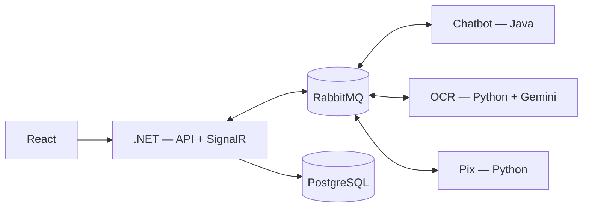
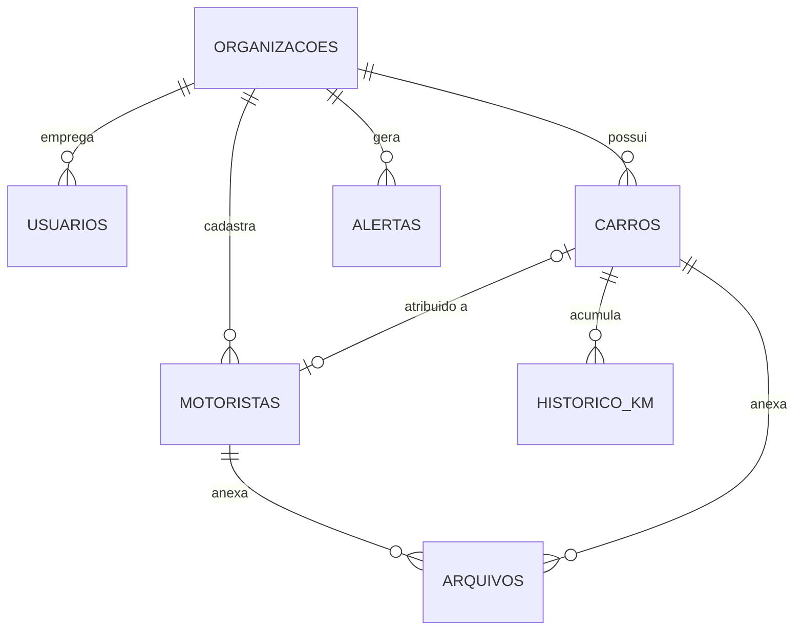

*This project has been created as part of the 42 curriculum by <login1>, <login2>, <login3>, <login4>.*

<!-- Substituam os logins acima pelos logins reais de cada integrante na 42. -->

# [Nome do projeto] — SaaS de gestão de frotas e motoristas

## Description

**[Nome do projeto]** é um SaaS multi-empresa (multi-tenant) para locadoras gerenciarem sua frota de veículos e seus motoristas em um único painel.

O objetivo central é reduzir trabalho manual repetitivo de duas frentes que normalmente consomem tempo do time operacional:

- **Controle de quilometragem e manutenção**: o motorista manda uma foto do odômetro pelo chat, o sistema extrai o número automaticamente (OCR via IA), atualiza o km rodado na semana e dispara um alerta se ultrapassar o limite (ex.: 1250 km/semana) ou se estiver perto da manutenção preventiva.
- **Conferência de pagamento via Pix**: o motorista manda uma foto do comprovante, o sistema extrai valor e data, e confere automaticamente contra a caixa de e-mail da empresa (já que não existe API bancária gratuita para isso), confirmando ou sinalizando divergência.

Principais funcionalidades:
- Painel único com busca de motorista (por CPF/e-mail) e busca de carro (por placa), carregando todos os dados vinculados para edição.
- Chat automatizado com menu (atendimento humano ou fluxo automático de foto de km / foto de Pix).
- Upload e armazenamento seguro de documentos (CNH, contrato, CRV, comprovantes).
- Painel de alertas (km excedido, manutenção próxima, Pix pendente/divergente) com marcação de "tratado".
- Multi-empresa: cada organização só enxerga seus próprios motoristas, carros e alertas.
- Múltiplos usuários (gestores/operadores) trabalhando ao mesmo tempo, com atualizações em tempo real.

## Instructions

### Pré-requisitos
- [Docker](https://docs.docker.com/get-docker/) e Docker Compose v2
- Uma chave de API gratuita do Gemini: https://aistudio.google.com/apikey
- Uma conta de e-mail dedicada para receber comprovantes de Pix (recomendado: Gmail com senha de app)

### Passo a passo
1. Clonar o repositório:
   ```bash
   git clone <url-do-repositorio>
   cd <pasta-do-repositorio>
   ```
2. Criar o arquivo de variáveis de ambiente:
   ```bash
   cp .env.example .env
   ```
3. Preencher o `.env` com os valores reais (`GEMINI_API_KEY`, credenciais de e-mail, segredos do JWT, etc.) — ver comentários em `.env.example`.
4. Subir todos os serviços com um único comando:
   ```bash
   docker compose up --build
   ```
5. Acessar:
   - Frontend: `https://localhost`
   - API do backend: `https://localhost:8443`
   - Painel do RabbitMQ: `http://localhost:15672`

> Certificados HTTPS locais: para desenvolvimento/avaliação, o backend e o frontend usam certificado autoassinado (gerado em `./backend/certs` e `./frontend/certs` — instruções de geração no README de cada pasta). O navegador vai pedir para confiar no certificado na primeira vez.

## Resources

### Documentação de referência
- ASP.NET Core: https://learn.microsoft.com/aspnet/core
- Spring Boot / Spring AMQP: https://spring.io/projects/spring-amqp
- RabbitMQ: https://www.rabbitmq.com/docs
- Gemini API: https://ai.google.dev/gemini-api/docs
- PostgreSQL: https://www.postgresql.org/docs
- React: https://react.dev

### Uso de IA neste projeto
> ⚠️ Preencher com honestidade e detalhe — durante a avaliação vocês precisam ser capazes de explicar qualquer parte assistida por IA. Descrições genéricas ("usamos IA para ajudar") não são suficientes (ver Capítulo I do subject).
>
> Sugestão de estrutura para preencher:
> - **Planejamento/arquitetura**: [ex.: discussão inicial da arquitetura de microsserviços e do contrato de eventos foi feita com apoio de IA generativa; decisões finais e ajustes foram do time].
> - **Código gerado**: [especificar exatamente quais arquivos/funções, e quem do time revisou e entende cada trecho].
> - **Documentação**: [ex.: rascunho inicial deste README e dos docs de schema/eventos].
> - **O que NÃO foi gerado por IA**: [deixar claro o que foi 100% desenvolvido pelo time].

## Team Information

| Nome | Login 42 | Papel(éis) | Responsabilidades |
|---|---|---|---|
| [Nome 1] | [login1] | Product Owner | [preencher] |
| [Nome 2] | [login2] | Project Manager / Dev | [preencher] |
| [Nome 3] | [login3] | Tech Lead / Dev | [preencher] |
| [Nome 4] | [login4] | Developer | [preencher] |

## Project Management

- **Organização das tarefas**: [ex.: GitHub Projects / Issues, um board por serviço]
- **Reuniões**: [ex.: sync semanal às terças, 30min]
- **Canal de comunicação**: [ex.: Discord]
- **Divisão do trabalho**: [ex.: cada serviço (backend, chatbot, ocr, pix, frontend) teve um responsável principal + revisão cruzada via pull request]

## Technical Stack

Arquitetura poliglota — cada serviço na linguagem em que faz mais sentido, comunicando-se por eventos JSON via RabbitMQ (ver `docs/message-contracts.md`).



| Camada | Tecnologia | Por quê |
|---|---|---|
| Frontend | React | Ecossistema maduro, time já tem familiaridade |
| Backend principal | .NET / ASP.NET Core | Auth (Identity com hash+salt nativo), MVC, API REST, tempo real via SignalR, ORM (EF Core) |
| Chatbot | Java (Spring Boot) | Menu automatizado do atendimento, roteia eventos entre os fluxos |
| Serviço de OCR | Python (FastAPI) + Gemini | Melhor ecossistema para chamadas de IA multimodal, serviço genérico (imagem → texto) |
| Serviço de Pix | Python (FastAPI) | Leitura de e-mail via IMAP é simples e direta em Python |
| Mensageria | RabbitMQ | Desacopla os 3 serviços; permite padrão RPC (correlation_id) sem chamadas síncronas travando o chatbot |
| Banco de dados | PostgreSQL | Suporta escrita concorrente de verdade (diferente de SQLite), requisito do subject de múltiplos usuários simultâneos |
| Deploy | Docker Compose | Um único comando (`docker compose up`), cada serviço em sua própria imagem |

## Database Schema

Ver detalhamento completo em [`docs/database-schema.md`](docs/database-schema.md). Resumo:



Tabelas: `organizacoes`, `usuarios`, `motoristas`, `carros`, `arquivos`, `alertas`, `historico_km`. Documentos (CNH, CRV, contratos, comprovantes) nunca são salvos como blob no banco — só um hash + caminho, apontando para um volume Docker (`/storage`).

## Features List

| Funcionalidade | Descrição | Responsável |
|---|---|---|
| Login e autenticação | E-mail + senha com hash/salt (.NET Identity) | [preencher] |
| Painel geral com busca | Busca motorista por CPF/e-mail e carro por placa, carrega dados editáveis | [preencher] |
| CRUD motoristas/carros | Cadastro, edição e exclusão com validação frontend + backend | [preencher] |
| Upload de documentos | CNH, contrato, CRV com validação de tipo/tamanho e preview | [preencher] |
| Chatbot com menu | Atendimento humano ou fluxo automatizado (foto km / foto Pix) | [preencher] |
| OCR de imagens | Extração de texto via Gemini, serviço genérico e reutilizável | [preencher] |
| Verificação de Pix | Conferência automática contra caixa de e-mail da empresa | [preencher] |
| Controle de km/manutenção | Atualização automática + alerta de km excedido/manutenção próxima | [preencher] |
| Painel de alertas | Lista de riscos por motorista/carro, com marcação de tratado | [preencher] |
| Multi-empresa | Isolamento de dados por organização | [preencher] |
| Permissões por papel | admin / gestor / operador com views diferentes | [preencher] |
| Dashboard de analytics | Gráficos de km, manutenção e alertas ao longo do tempo | [preencher] |
| Tempo real | Atualizações via WebSocket (SignalR) para todos os usuários conectados | [preencher] |

## Modules

Pontuação alvo: **16 pontos** (mínimo exigido: 14), com margem de segurança caso algum módulo não seja validado.

| Categoria | Módulo | Tipo | Pontos | Justificativa |
|---|---|---|---|---|
| Web | Framework frontend + backend (React + ASP.NET Core) | Major | 2 | Ambos usados em sua capacidade completa (roteamento, state, ORM, etc.) |
| Web | API pública documentada (API key + rate limiting, 5+ endpoints) | Major | 2 | CRUD de motoristas/carros exposto como API REST versionada e documentada |
| Web | Upload e gestão de arquivos | Minor | 1 | CNH, contrato e CRV com validação, preview e exclusão |
| Web | Real-time via WebSocket | Major | 2 | SignalR para alertas e atualizações refletidas em todos os clientes conectados |
| User Management | Sistema de permissões avançado | Major | 2 | Papéis admin/gestor/operador com views e ações distintas |
| User Management | Sistema de organizações | Major | 2 | Multi-tenant: cada locadora gerencia sua própria frota isoladamente |
| Data and Analytics | Dashboard de analytics avançado | Major | 2 | Gráficos de km, manutenção e alertas, com filtros de data |
| Artificial Intelligence | Reconhecimento de imagem (OCR) | Minor | 1 | Extração de texto de fotos via Gemini |
| Devops | Backend como microsserviços | Major | 2 | Três serviços independentes (.NET, Java, Python) comunicando-se via RabbitMQ |
| **Total** | | | **16** | |

Todos os módulos serão demonstrados ao vivo na avaliação, conforme exigido pelo subject.

## Individual Contributions

### [Nome 1]
- **Módulos/features implementados**: [preencher]
- **Desafios enfrentados**: [preencher]

### [Nome 2]
- **Módulos/features implementados**: [preencher]
- **Desafios enfrentados**: [preencher]

### [Nome 3]
- **Módulos/features implementados**: [preencher]
- **Desafios enfrentados**: [preencher]

### [Nome 4]
- **Módulos/features implementados**: [preencher]
- **Desafios enfrentados**: [preencher]

## Outras informações

- **Privacy Policy** e **Terms of Service**: acessíveis pelo rodapé da aplicação, com conteúdo real referente aos dados tratados (CPF, RG, endereço — alinhado à LGPD).
- **Limitações conhecidas**: [preencher conforme o projeto evoluir]
- **Licença**: [preencher, se aplicável]
