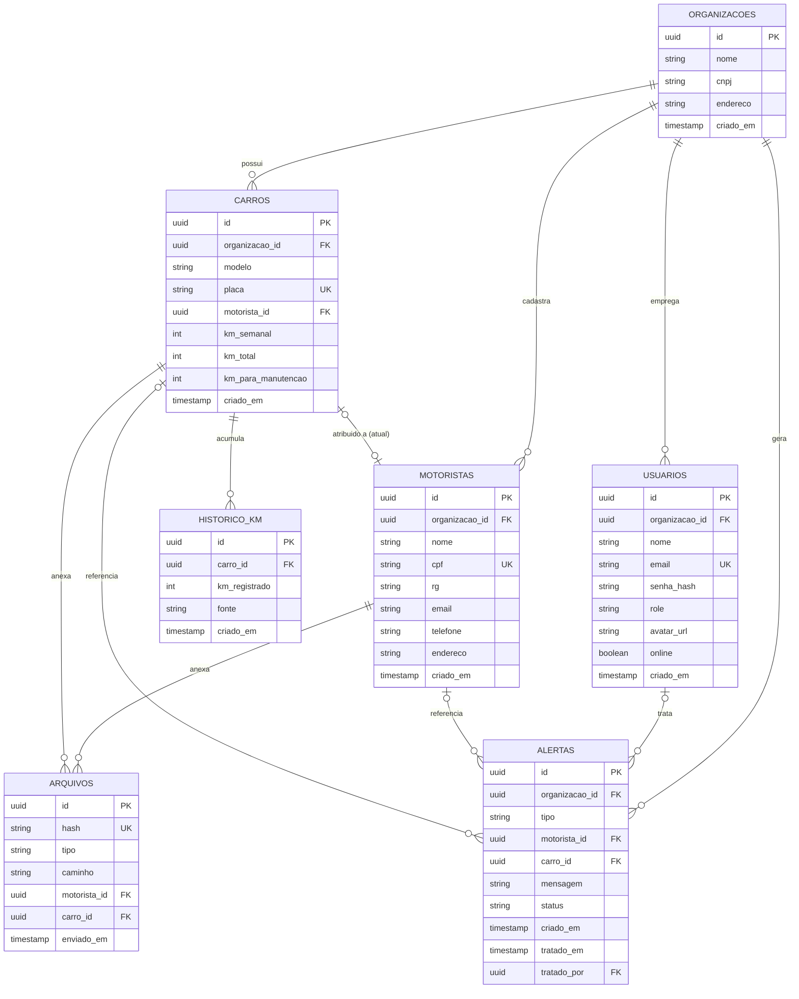

# Schema do banco de dados

Banco: **PostgreSQL 16**. IDs em `uuid` (gerados na aplicação ou via `gen_random_uuid()`) em vez de inteiros incrementais — evita colisão quando mais de um serviço/linguagem pode vir a criar registros de forma independente, prática padrão em arquiteturas com múltiplos serviços.

## Diagrama

## Decisão de design: vínculo motorista ↔ carro

No rascunho original a ideia era ter um campo "carro vinculado" tanto em `motoristas` quanto em `carros`. Isso é redundante e perigoso: se algum fluxo atualizar só um dos dois lados, os registros ficam inconsistentes (motorista aponta pro carro X, mas o carro aponta pra outro motorista).

Decisão: a FK vive **só em `carros.motorista_id`** (um carro está atribuído a zero ou um motorista no momento). Para saber qual carro um motorista dirige, faz-se a consulta inversa (`SELECT * FROM carros WHERE motorista_id = ?`). Se no futuro for necessário histórico de troca de carro por motorista, isso vira a tabela `historico_atribuicoes` — não precisa disso agora.

## Tabelas

### `organizacoes`
Cada locadora que usa o SaaS (multi-tenant). Todo dado de negócio (`usuarios`, `motoristas`, `carros`, `alertas`) pertence a uma organização — é o que sustenta o módulo **Organization system**.

### `usuarios`
Quem acessa o painel (não confundir com `motoristas`, que não fazem login). `role` controla o módulo **Advanced permissions** (`admin`, `gestor`, `operador`). Senha sempre com hash + salt (bcrypt/argon2 no backend .NET via `Identity` ou `BCrypt.Net`).

### `motoristas`
Campos exatamente como descritos: nome, cpf, rg, email, telefone, endereço. **Não guarda a CNH nem o contrato como blob** — isso vive em `arquivos`, referenciado por hash.

### `carros`
Modelo, placa, km semanal, km para manutenção, e o vínculo com o motorista atual. O CRV segue a mesma lógica de `arquivos`.

### `arquivos`
Tabela única para qualquer documento anexado (CNH, contrato, CRV, comprovante de Pix). `tipo` diferencia o que é. `hash` identifica o arquivo fisicamente salvo em `/storage/{tipo}/{hash}.ext` (volume Docker compartilhado — nunca base64 no banco).

### `alertas`
Cobre o módulo **Notification system**: km excedido, manutenção próxima, Pix pendente/divergente. `status` (`pendente`/`tratado`) + `tratado_por`/`tratado_em` é o que dá suporte ao checkbox de "limpar alerta já tratado" da segunda tela que você desenhou.

### `historico_km`
Guarda cada leitura de km (vinda de foto do odômetro), com a `fonte` (`foto` ou `manual`). Permite calcular km rodado na semana sem depender só do valor atual — e dá material de graça pro módulo **Advanced analytics dashboard** (gráfico de km ao longo do tempo).
